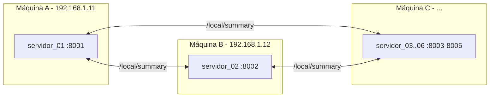

# Sistema Distribuído de Consultas — Uber NYC 2014

Trabalho prático UNEB · LPIII

**6 servidores FastAPI** (abril–setembro/2014). Qualquer nó responde localmente e pode coordenar `/summary` agregando os demais.

## Pré-requisitos

- Python 3.10+ instalado (`python --version`)
- Conexão com a internet na primeira subida (os CSVs são baixados do GitHub)

## Passo a passo para executar

1. **Entre na pasta do projeto**

   ```powershell
   cd uber-distributed
   ```

2. **Crie e ative o ambiente virtual**

   ```powershell
   python -m venv venv
   .\venv\Scripts\Activate.ps1
   ```

   O prompt deve passar a mostrar `(venv)` no início da linha.

3. **Instale as dependências**

   ```powershell
   pip install -r requirements.txt
   ```

4. **Suba o cluster**

   ```powershell
   python start.py
   ```

   Isso abre **6 janelas de terminal novas**, uma por servidor (`servidor_01` a `servidor_06`), cada uma mostrando os logs daquele nó. Aguarde até ver `Uvicorn running on http://0.0.0.0:80XX` em cada janela (a primeira subida demora um pouco mais, pois os CSVs são baixados da internet).

5. **Abra a interface no navegador**

   Acesse **http://localhost:8001/** — a mesma interface também está disponível em http://localhost:8002/, .../8003/, .../8004/, .../8005/ e .../8006/.

6. **Faça uma consulta**

   - Veja o status dos 6 nós no painel **Cluster**.
   - Escolha as datas (e, opcionalmente, a base) e o escopo (distribuído ou local).
   - Clique em **Executar consulta**.

7. **Encerre o cluster quando terminar**

   ```powershell
   python start.py stop
   ```

   Isso fecha as 6 janelas (mata os processos que estão ouvindo nas portas 8001–8006).

### Outros comandos úteis

```powershell
python start.py 1      # sobe só o servidor 01 (abril), no terminal atual
python start.py 2      # sobe só o servidor 02 (maio)
python start.py 3      # … e assim por diante até 6
python start.py stop   # encerra tudo
```

### Qual comando usar? (local vs rede)

| Situação | Comando |
|----------|---------|
| Testar os **6 nós na sua máquina** | `python start.py` |
| Subir **só o servidor 1 (abril)** | `python start.py 1` |
| Rede real (1 máquina por grupo) | `$env:KNOWN_SERVERS = "..."` e depois `python start.py N` |

**Exemplo — seu grupo ficou com o servidor 1 (abril):**

```powershell
# Só o nó 1, na sua máquina (sem falar com outros grupos ainda)
python start.py 1
```

```powershell
# Nó 1 em rede, falando com os outros 5 grupos (troque pelos IPs reais)
$env:KNOWN_SERVERS = "http://IP_DO_2:8002,http://IP_DO_3:8003,http://IP_DO_4:8004,http://IP_DO_5:8005,http://IP_DO_6:8006"
python start.py 1
```

Sem `KNOWN_SERVERS`, o servidor 1 sobe normalmente, mas tenta contatar os vizinhos em `localhost` (só funciona se os outros nós também estiverem na mesma máquina).

Interface do servidor 1: **http://localhost:8001/** (ou `http://SEU_IP:8001/` na rede).

## Estrutura

```
uber-distributed/
├── start.py
├── server/app.py
├── static/index.html
├── data/              # servidor_XX.db (gerados na 1ª subida)
├── tests/
└── requirements.txt
```

| Servidor    | Mês           | Porta | Interface              |
|-------------|---------------|-------|------------------------|
| servidor_01 | Abril/2014    | 8001  | http://localhost:8001/ |
| servidor_02 | Maio/2014     | 8002  | http://localhost:8002/ |
| servidor_03 | Junho/2014    | 8003  | http://localhost:8003/ |
| servidor_04 | Julho/2014    | 8004  | http://localhost:8004/ |
| servidor_05 | Agosto/2014   | 8005  | http://localhost:8005/ |
| servidor_06 | Setembro/2014 | 8006  | http://localhost:8006/ |

## Endpoints

| Rota | O que faz |
|------|-----------|
| `GET /health` | Status do nó |
| `GET /metadata` | Intervalo de dados do nó e servidores conhecidos |
| `GET /local/summary` | Só dados locais |
| `GET /summary` | Agrega os 6 nós |

Parâmetros: `start_date`, `end_date` (obrigatórios) e `base` (opcional).

```bash
curl http://localhost:8001/health
curl "http://localhost:8001/summary?start_date=2014-04-01&end_date=2014-09-30"
```

## Variáveis de ambiente

| Variável | Obrigatória? | Exemplo | Descrição |
|----------|--------------|---------|-----------|
| `SERVER_PORT` | Não (padrão `8001`) | `8004` | Qual partição este processo serve: `8001` a `8006` |
| `KNOWN_SERVERS` | Não | `http://192.168.1.12:8002,http://192.168.1.13:8003` | URLs dos outros nós, separadas por vírgula. Sem isso, assume `localhost` (todos os nós na mesma máquina) |
| `HTTP_TIMEOUT` | Não (padrão `10`) | `20` | Timeout, em segundos, de cada chamada deste nó a um vizinho. Útil aumentar em redes com maior latência |

Docs: http://localhost:8001/docs

## Rodando em máquinas diferentes na mesma rede

Por padrão os 6 nós rodam na mesma máquina, se enxergando por `localhost`. Para rodar cada servidor em um computador diferente (mesma rede local), configure a variável de ambiente `KNOWN_SERVERS` com os IPs reais dos outros cinco nós.

**Resumo rápido**

| Local (sua máquina) | Rede (1 máquina por grupo) |
|---------------------|----------------------------|
| `python start.py` | `python start.py N` (só o seu nó) |
| sem `KNOWN_SERVERS` | `KNOWN_SERVERS` com IPs reais |
| `http://localhost:8001/` | `http://SEU_IP:8001/` |

Se o seu grupo for o **servidor 1 (abril)**, use `python start.py 1` com `KNOWN_SERVERS` apontando para as outras 5 máquinas (veja o exemplo logo abaixo e também a seção “Qual comando usar?” acima).



1. **Descubra o IP de cada máquina** na rede local (Windows: `ipconfig`, procure "Endereço IPv4").

2. **Em cada máquina**, defina `KNOWN_SERVERS` com os IPs **reais** das outras cinco e suba **só o nó daquela máquina** (nunca `python start.py` sem argumento, pois ele tenta subir os 6 nós na mesma máquina):

   ```powershell
   # Máquina A (servidor_01, porta 8001)
   $env:KNOWN_SERVERS = "http://192.168.1.12:8002,http://192.168.1.13:8003,http://192.168.1.14:8004,http://192.168.1.15:8005,http://192.168.1.16:8006"
   python start.py 1
   ```

   ```powershell
   # Máquina B (servidor_02, porta 8002)
   $env:KNOWN_SERVERS = "http://192.168.1.11:8001,http://192.168.1.13:8003,http://192.168.1.14:8004,http://192.168.1.15:8005,http://192.168.1.16:8006"
   python start.py 2
   ```

   Repita o mesmo padrão nas demais 4 máquinas (`python start.py 3`, `4`, `5`, `6`), sempre listando as outras cinco URLs em `KNOWN_SERVERS`.

3. **Libere a porta no firewall** de cada máquina (Windows Defender Firewall → Regras de Entrada → Nova Regra → TCP → porta específica, ex. 8001).

4. **Acesse a interface** pelo IP de qualquer máquina, ex. `http://192.168.1.11:8001/`, e faça uma consulta **distribuída** — ela deve contatar as outras cinco máquinas pela rede e retornar `"complete": true`.

Se `KNOWN_SERVERS` não for definido, o servidor usa o padrão `localhost` (bom para testar os 6 nós juntos em uma única máquina, como na seção anterior).

### Em sala de aula (um grupo por máquina)

Sim: **cada grupo configura os IPs dos outros servidores** na variável `KNOWN_SERVERS`. Não existe descoberta automática — a lista é estática e precisa ser combinada entre os grupos.

**Passo a passo em sala**

1. Todo mundo na **mesma rede** (mesmo Wi‑Fi / mesma lab). Os IPs devem ficar na mesma sub-rede (ex.: todos `192.168.0.x`). Se um PC estiver em `192.168.0.x` e outro em `192.168.1.x`, em geral **não** se enxergam.
2. Cada grupo anota o próprio IPv4 (`ipconfig` → "Endereço IPv4") e a porta do seu servidor.
3. Combinam a lista (quadro, chat, etc.), por exemplo:

   | Grupo | Servidor | Porta | IP (exemplo) |
   |-------|----------|-------|--------------|
   | A | servidor_01 (abril) | 8001 | 192.168.0.162 |
   | B | servidor_02 (maio) | 8002 | 192.168.0.176 |
   | C | servidor_03 (junho) | 8003 | 192.168.0.50 |
   | … | … | … | … |

4. Em **cada máquina**, monte `KNOWN_SERVERS` só com os **vizinhos** (não inclua o próprio IP) e suba **apenas** o nó do grupo:

   ```powershell
   # Exemplo — grupo do servidor 1 (abril), na máquina 192.168.0.162
   $env:KNOWN_SERVERS = "http://192.168.0.176:8002,http://192.168.0.50:8003,http://192.168.0.51:8004,http://192.168.0.52:8005,http://192.168.0.53:8006"
   python start.py 1
   ```

   ```powershell
   # Exemplo — grupo do servidor 2 (maio), na máquina 192.168.0.176
   $env:KNOWN_SERVERS = "http://192.168.0.162:8001,http://192.168.0.50:8003,http://192.168.0.51:8004,http://192.168.0.52:8005,http://192.168.0.53:8006"
   python start.py 2
   ```

5. Liberem a porta no firewall de cada máquina.
6. Testem a interface pelo IP do coordenador (ex.: `http://192.168.0.162:8001/`) com escopo **distribuído**. No painel Cluster, os vizinhos devem aparecer **online** e a consulta com `"complete": true`.

**Dicas**

- Se o IP mudar (DHCP / trocar de rede), atualize `KNOWN_SERVERS` e **reinicie** o `python start.py N`.
- Comunicação só em um sentido (A → B funciona, B → A não) costuma ser IP errado na lista ou firewall bloqueando a porta de entrada.
- Para validar um vizinho antes da consulta: `Invoke-WebRequest http://IP_DO_VIZINHO:PORTA/health`.

## Como funciona

1. Cada servidor guarda **só o seu mês** em um arquivo SQLite em disco (`data/servidor_XX.db`), indexado por data.
2. Na **primeira** subida o CSV é baixado e importado; nas seguintes o `.db` é reaproveitado (startup bem mais rápido).
3. `/local/summary` conta só neste nó, com uma consulta SQL indexada.
4. `/summary` agrega chamando `/local/summary` nos vizinhos (sem ciclo) e devolve o `query` recebido junto com o resultado.
5. Vizinho fora do ar → `failed_servers` e `"complete": false`.

## Testes

Com o cluster no ar:

```powershell
pip install pytest
pytest tests/test_server.py -v
```

## Dados

Fonte: https://github.com/fivethirtyeight/uber-tlc-foil-response/tree/master/uber-trip-data

Cada servidor grava seu banco em `data/`:

| Arquivo | Conteúdo |
|---------|----------|
| `data/servidor_01.db` | Abril/2014 |
| `data/servidor_02.db` | Maio/2014 |
| `data/servidor_03.db` | Junho/2014 |
| `data/servidor_04.db` | Julho/2014 |
| `data/servidor_05.db` | Agosto/2014 |
| `data/servidor_06.db` | Setembro/2014 |

Os `.db` são gerados automaticamente e **não** entram no Git. Para forçar uma reimportação do CSV, apague o `.db` correspondente e suba o servidor de novo.

Para usar CSV local em vez da URL, altere `data_file` na tabela `NODES` em `server/app.py`.
